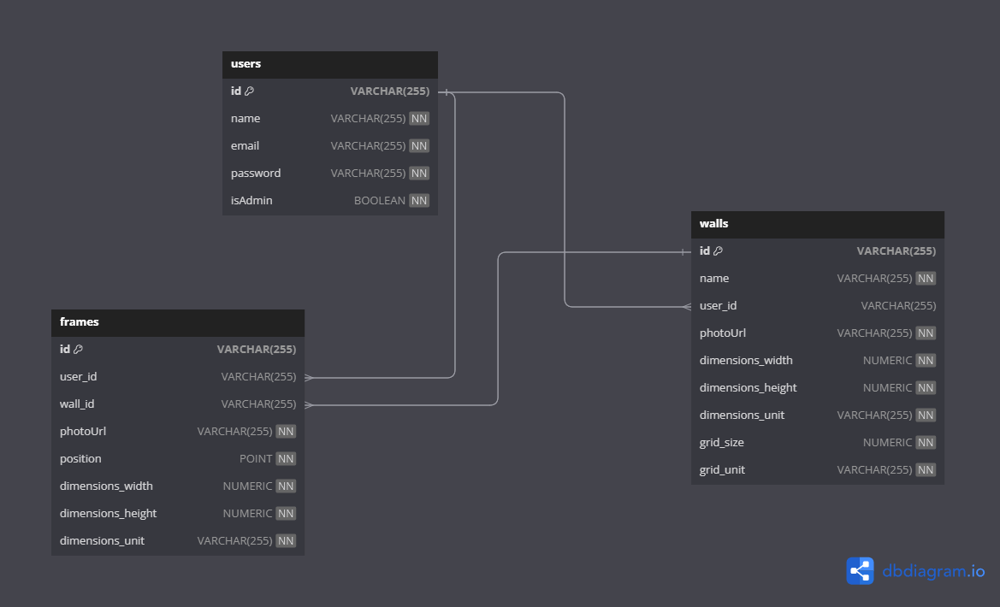

# Plan!

## Data

We need to know about everything, from the start!

We will need to store frames, walls, users

## Shape of data

### Frames

```jsx
type Frame = {
  id: String,
  userId: String,
  wallId: String,
  photoUrl: String,
  position: [Number, Number],
  dimensions: {
    width: Number,
    height: Number,
    unit: String,
  },
};
```

### Walls

```jsx
type Wall = {
  id: String,
  name: String,
  userId: String,
  photoUrl: String,
  dimensions: {
    width: Number,
    height: Number,
    unit: String,
  },
  grid: {
    size: Number,
    unit: String,
  },
};
```

### Users

```jsx
type User = {
  id: String,
  name: String,
  email: String,
  password: String,
  isAdmin: Boolean,
};
```

### Database

### ERD



### Schema

```sql
CREATE TABLE IF NOT EXISTS users (
  id VARCHAR(255) PRIMARY KEY,
  name VARCHAR(255) NOT NULL,
  email VARCHAR(255) UNIQUE NOT NULL,
  password VARCHAR(255) NOT NULL,
  is_admin BOOLEAN NOT NULL
);

CREATE TABLE IF NOT EXISTS frames (
  id VARCHAR(255) PRIMARY KEY,
  user_id VARCHAR(255) REFERENCES users(id),
  wall_id VARCHAR(255) REFERENCES walls(id),
  photoUrl VARCHAR(255) NOT NULL,
  position POINT NOT NULL,
  dimensions_width NUMERIC NOT NULL,
  dimensions_height NUMERIC NOT NULL,
  dimensions_unit VARCHAR(255) NOT NULL,
  CHECK (ARRAY_LENGTH(position, 1) = 2)
);

CREATE TABLE IF NOT EXISTS walls (
  id VARCHAR(255) PRIMARY KEY,
  name VARCHAR(255) NOT NULL,
  user_id VARCHAR(255) REFERENCES users(id),
  photoUrl VARCHAR(255) NOT NULL,
  dimensions_width NUMERIC NOT NULL,
  dimensions_height NUMERIC NOT NULL,
  dimensions_unit VARCHAR(255) NOT NULL,
  grid_size NUMERIC NOT NULL,
  grid_unit VARCHAR(255) NOT NULL
);

```

## View

Wireframes, Color palette / fonts, Mockups


