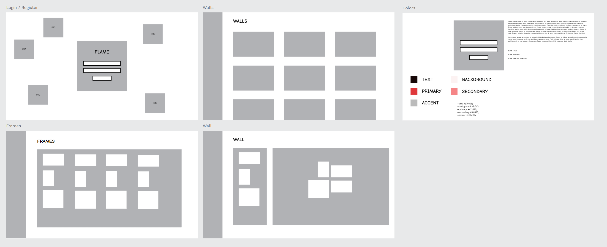

# Plan!

## Data

We need to know about the versions, and it will be rebuilt as we go

## Versions

- Version 1 : Users can put frames on a wall, saved locally in local storage
- Version 2 : Users can add photos to the frame, add better touch control
- Version 3 : Users can change the wall size and look
- Version 4 : Users can register and create multiple walls

## Shape of data (Version 1)

### Frames

```jsx
type Frame = {
  id: String,
  color: String,
  position: [Number, Number],
  dimensions: {
    width: Number,
    height: Number,
    unit: String,
  },
};
```

## Shape of data (Version 2)

### Frames

```jsx
type Frame = {
  id: String,
  color: String,
  photoUrl: String,
  position: [Number, Number],
  dimensions: {
    width: Number,
    height: Number,
    unit: String,
  },
};
```

## Shape of data (Version 3)

### Frames

```jsx
type Frame = {
  id: String,
  userId: String,
  wallId: String,
  photoUrl: String,
  position: [Number, Number],
  dimensions: {
    width: Number,
    height: Number,
    unit: String,
  },
};
```

### Walls

```jsx
type Wall = {
  id: String,
  photoUrl: String,
  dimensions: {
    width: Number,
    height: Number,
    unit: String,
  },
  grid: {
    size: Number,
    unit: String,
  },
};
```

## Shape of data (Version 4)

### Frames

```jsx
type Frame = {
  id: String,
  userId: String,
  wallId: String,
  photoUrl: String,
  position: [Number, Number],
  dimensions: {
    width: Number,
    height: Number,
    unit: String,
  },
};
```

### Walls

```jsx
type Wall = {
  id: String,
  name: String,
  userId: String,
  photoUrl: String,
  dimensions: {
    width: Number,
    height: Number,
    unit: String,
  },
  grid: {
    size: Number,
    unit: String,
  },
};
```

### Users

```jsx
type User = {
  id: String,
  name: String,
  email: String,
  password: String,
  isAdmin: Boolean,
};
```

## View

Wireframes, Color palette / fonts, Mockups


