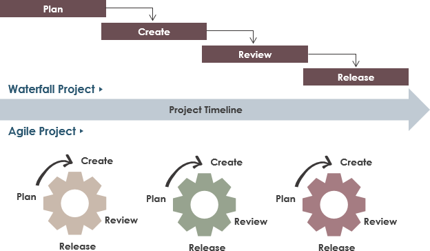

# Project Planning

## Today's Menu

- What is a project?
- Project management styles
- Project planning
- Create timelines
- Organization tips

## What is a project?

By definition, we describe a project as a planned set of tasks or undertaking. For your execution to be called a project, there needs to be some sort of requirement(s), and a plan in order to reach that desired outcome. So what does that look like?

### Project examples

- TinyApp
- Tweeter
- Midterm Project

### Project types

- Personal
- Contracts
- Fulltime work (Company)

## Project management styles

There are two popular approachs currently for project management, Waterfall & Agile. Is one better than the other? It really depends on the project and scope, but also each management style has pros and cons, and will be different between companies.

### Waterfall

The waterfall approach is more traditional where you first build your plan, then create, review and finally, release a project.

Each piece is worked on one at a time to ultimately launch the project at-once

- This could mean: discovery, design, wireframing, ERD, database, then back-end, then front-end, then styling, then a testing / fixes period
- Prone to roadblocks
- More solid initial planning
- Less flexible during development
- Can be harder to split up tasks

### Agile

The agile approach is more recent, and projects built using this method will be iterative.

It's designed to deliver a product in smaller, faster "stages" / "sprints", where a sprint is a defined period of time (ex: 2 weeks) that a feature must be completed to a launch-ready point.

- Agile focuses a lot on individual interactions rather than processes / tools
- Software that works is prioritized over documentation
- Collaboration with the client rather than "contract negotiation"
- Responding to change over following a plan
- Agile is focused on continuous delivery
- Many entry points for changes, whether that's bugs, changing business priorities, user feedback

## Project planning

Planning a project is great! But you may end up not following the plan since things change...

When building a project, we should follow this sequence;

- Initial Idea
- User Stories
- Data
  - Shape of data
  - Database
  - ERD
- View
  - Wireframes
  - Color palette / fonts
  - Mockups
- Tooling
  - Frameworks
  - Libraries
  - Collaboration tools (Github, Trello, etc)

## Create timelines

A critical part of project planning is to know how long tasks will take. However it's hard to know how long they take, here's a couple of tips to help you;

- Use time tracking tools to help you know how long it takes to build a feature
- Use a Kanban board like Trello and make sure to create small tasks (easier to estimate)
- Overestimate the time you think it'll take to complete a task (Underpromise, overdeliver)
- Meet often with your teamates (Daily stand-ups) to know if anything is blocking

## Organization tips

### Take notes!

- Meeting, planning, research... these are all opportunities to make a note for later
- Tools: [Obsidian](https://obsidian.md/), [EverNote](https://evernote.com/), [Inkdrop](https://www.inkdrop.app/)

### Have a calendar!

- For meetings and core dates, it can be easy to double-book, miss something, or simply forget
- Use [Google Calendar](https://calendar.google.com/) (or a similar app), it can notify you on your phone, in your e-mail, etc. about scheduled meetings and any changes—get in the habit of checking it often!

### Have a schedule!

- Protect work-time and relaxation time
- You need focus-hours in the day where interruptions can be minimized
- Avoid social media and other distractions when working—sometimes it helps to have separate accounts on your OS, or two devices, one for work and one for leisure
- Have set times for relaxation to ensure you're taking breaks—protect an evening with the family, etc.
- Still having trouble focusing? Consider the [Pomodoro Technique](https://en.wikipedia.org/wiki/Pomodoro_Technique) and use of [online timers](https://pomofocus.io/):
  1. Decide on a task
  2. Work on the task for ~25 minutes
  3. Take a break (5-10 minutes)
  4. Repeat the above 3 times
  5. Take a 20-30 minute break and return to step 1

## Resources

- [Agile versus Waterfall](https://www.atlassian.com/agile/project-management/project-management-intro)
- [User Stories](https://www.atlassian.com/agile/project-management/user-stories)
- [Kanban](https://www.atlassian.com/agile/kanban/boards)
- [ERD Drawing Tools](https://sharingknowledge.world.edu/5-best-entity-relationship-diagram-erd-tools/)
- [Wireframe Tools](https://webflow.com/blog/wireframe-tools)
- [Note-Taking Apps](https://www.techradar.com/best/best-note-taking-app)
